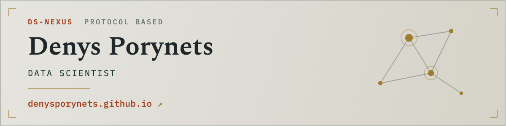
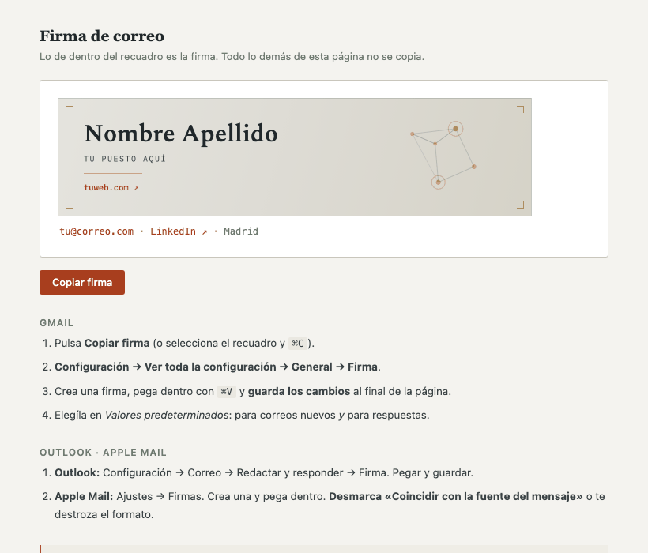
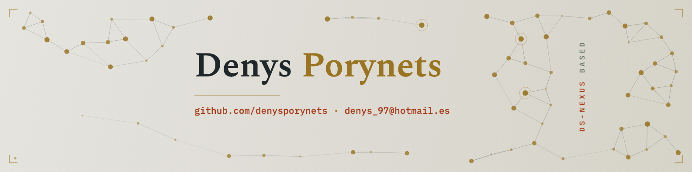

> Para Jose Ignacio Hacker Navarro, Att Denys :)

# Kit de firma de correo

Un generador de **firma de correo, banner y portada de LinkedIn** a partir de un
único fichero de configuración. Editas tus datos, ejecutas un comando y te salen
las piezas listas para pegar.

No hay que saber programar. Hay que cambiar texto entre comillas.



---

## Cómo se usa

**1 · Descarga el proyecto.** Botón verde *Code → Download ZIP*, y lo
descomprimes. (O `git clone` si te manejas.)

**2 · Abre `perfil.py`** con cualquier editor de texto y cambia tus datos:
nombre, puesto, correo, enlaces y colores. Está todo comentado y es el único
fichero que hay que tocar.

**3 · Abre la Terminal en esa carpeta y ejecuta:**

```bash
python3 generar.py
```

Todo aparece en la carpeta `salida/`.

> **Truco para abrir la Terminal en la carpeta correcta (Mac):** escribe `cd `
> en la Terminal, con el espacio al final, arrastra la carpeta encima de la
> ventana y pulsa Enter.

---

## Qué te genera

| Fichero | Qué es |
|---|---|
| `salida/firma.html` | **Lo que vas a usar.** Ábrelo en el navegador: tiene un botón *Copiar firma* y las instrucciones para Gmail, Outlook y Apple Mail |
| `salida/banner@2x.png` | El banner de la firma, 1200×300. Se muestra a 600 px para que se vea nítido en pantallas retina |
| `salida/banner@1x.png` | El mismo a 600×150, por si algún cliente antiguo se atraganta |
| `salida/correo.html` | Un correo de plantilla con la firma al pie, con botones de copiar |
| `salida/linkedin_portada.png` | Portada de LinkedIn, 1584×396 |



Para poner la firma en Gmail: **Configuración → Ver toda la configuración →
General → Firma**, pegas y **guardas los cambios al final de la página** (se
olvida mucho). Las instrucciones completas van dentro de `firma.html`.

---

## Qué necesitas

- **Python 3** — ya viene en cualquier Mac.
- **Google Chrome** — hace de motor: convierte el diseño en imagen. También vale
  Chromium o Edge.
- **Pillow** (opcional, solo baja el peso de los PNG): `pip3 install pillow`

---

## Personalizarlo de verdad

Todo lo que se toca está en `perfil.py`: nombre, puesto, correo, teléfono,
enlaces, ciudad, la paleta de cinco colores, las tipografías y el texto del
correo de plantilla. Un campo vacío (`""`) desaparece del diseño sin dejar hueco.

Para cambiar de aires rápido: toca solo el color `acento` y las `FUENTES`.
Combinaciones que funcionan bien juntas:

| Título | Monoespaciada | Sale |
|---|---|---|
| `Spectral` | `IBM Plex Mono` | sobrio, editorial (el de por defecto) |
| `Playfair Display` | `JetBrains Mono` | más clásico y con contraste |
| `Fraunces` | `Space Mono` | cálido, con carácter |
| `Syne` | `IBM Plex Mono` | moderno, casi de estudio de diseño |

**¿Y las formas?** El dibujo de la derecha, las escuadras de las esquinas y el
degradado del fondo no están en `perfil.py`: viven dentro de los generadores.
Para cambiar eso —y para pedir un rediseño entero, o documentos nuevos con la
misma identidad— está **[PROMPT.md](PROMPT.md)**, con los prompts ya escritos y,
sobre todo, con **qué no debe tocar la IA** para que la firma siga funcionando
en el correo.

---

## Tres cosas que aprendimos por las malas

Son las que hacen que esto funcione en el correo de verdad y no solo en el
navegador. Si tocas el código, no las pierdas:

**El banner va incrustado como imagen, no como HTML vivo.** Gmail y Outlook se
comen los degradados, el SVG y las tipografías de Google: lo que en el navegador
es una tarjeta, en el correo sería un churro de texto suelto. Por eso la imagen
viaja dentro de la propia firma, en base64 — no depende de ningún fichero de tu
ordenador y puedes borrar la carpeta después.

**Debajo del banner va texto real, no más imagen.** Se puede seleccionar,
se puede pinchar, y sigue estando ahí si el cliente de correo bloquea las
imágenes (por eso el `alt` lleva tu nombre y tu puesto). Y todo con tablas y
estilos en línea: Gmail borra los bloques `<style>` enteros al pegar.

**La portada de LinkedIn tiene dos zonas muertas.** La foto de perfil tapa la
esquina inferior izquierda, y el móvil recorta unos 228 px por cada lado. Casi
todas las portadas mal hechas lo son por esto. `gen_linkedin.py` las esquiva y
lleva las medidas apuntadas. Aun así: súbela, ábrete el perfil en el móvil y
míralo — es la única comprobación que vale.

---

## Los ficheros

```
perfil.py         ← el único que tienes que tocar
generar.py        ← lo ejecuta todo:  python3 generar.py
gen_banner.py     ← el banner de la firma
gen_firma.py      ← la firma + la página con el botón de copiar
gen_correo.py     ← el correo de plantilla (reutiliza la firma, no la duplica)
gen_linkedin.py   ← la portada de LinkedIn
_comun.py         ← fontanería compartida. Aquí no hay nada que tocar
PROMPT.md         ← prompts para adaptarlo con una IA
```

Cada generador se puede ejecutar suelto (`python3 gen_linkedin.py`) si solo
quieres rehacer una pieza.

---

## Ejemplo real

Así quedó la versión de la que sale este kit:


